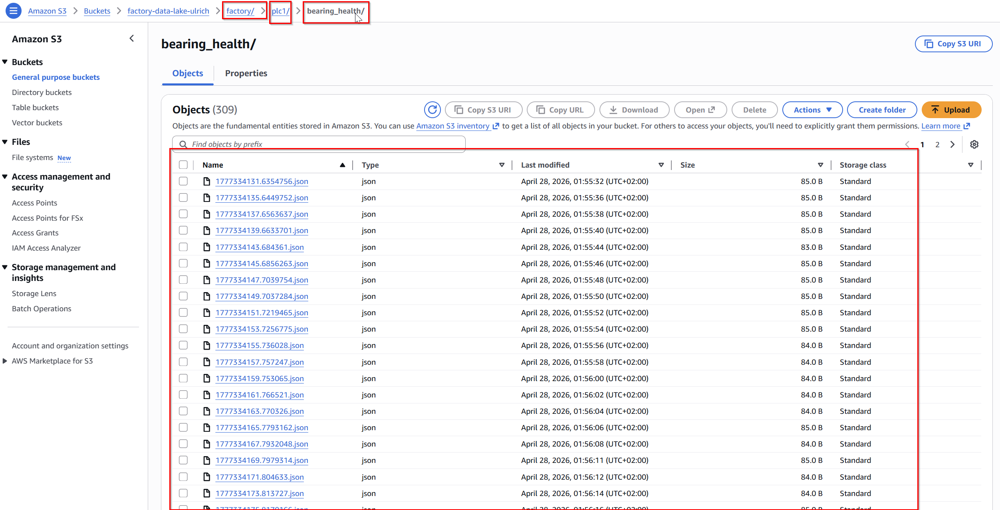

#  Corrigé – TP14

## Pipeline IoT vers un Data Lake avec AWS IoT Core

---

#  Objectifs – Correction

Dans ce TP, nous avons construit une architecture permettant de :

✔ connecter un Edge au cloud via un bridge MQTT
✔ centraliser les données industrielles
✔ stocker les données dans un Data Lake S3
✔ comprendre le rôle des IoT Rules
✔ mettre en place une architecture scalable

---

#  Contexte – Correction

Dans les TP précédents :

```text
✔ Edge autonome
✔ réaction aux événements cloud
✔ connexion à AWS IoT Core
```

---

👉 Limite :

```text
Les données restent locales et non exploitées
```

---

#  Problématique – Correction

```text
Les données existent… mais elles ne sont pas exploitées
```

👉 Problèmes :

* aucune centralisation
* aucune historisation
* aucune analyse possible

---

# 🧱 Architecture finale

```text
MQTT Broker local
        ↓
MQTT Bridge (Mosquitto)
        ↓
AWS IoT Core
        ↓
IoT Rule
        ↓
S3 (Data Lake)
```

---

#  Partie 1 — Bridge MQTT

## ✔️ Mise en place

* création d’un Thing AWS IoT
* récupération :

  * certificat
  * clé privée
  * AmazonRootCA1
  * endpoint

---

##  Configuration Mosquitto

```conf
connection aws-iot
address <endpoint>:8883

topic factory/# out 1

bridge_cafile /mosquitto/certs/AmazonRootCA1.pem
bridge_certfile /mosquitto/certs/device.pem.crt
bridge_keyfile /mosquitto/certs/private.pem.key

clientid edge-gateway
cleansession true
start_type automatic
```

---

## Explication

* `connection` → nom du bridge
* `address` → endpoint AWS IoT (TLS 8883)
* `topic` → envoie tous les messages `factory/+/+` vers AWS
* `bridge_cafile` → certificat racine AWS
* `bridge_certfile` → certificat du device
* `bridge_keyfile` → clé privée
* `clientid` → identifiant du device
* `cleansession` → pas de stockage de session
* `start_type` → démarrage automatique

---

##  Problèmes rencontrés

### ❌ Mauvais certificat

```text
device.pem.cert ≠ device.pem.crt
```

---

### ❌ Erreur TLS

```text
Unable to load CA certificates
```

👉 Cause :

```text
UID fichier ≠ UID Mosquitto (1883)
```

---

## ✔️ Correction

```yaml
owner: 1883
group: 1883
```

---

##  Permissions correctes

| Élément    | Permission |
| ---------- | ---------- |
| dossier    | 755        |
| certificat | 644        |
| clé privée | 600        |

---

# Partie 2 — Broker Mosquitto

## ✔️ Rôle

```text
✔ recevoir les données locales
✔ les relayer vers AWS IoT
```

---

## ✔️ Résultat

```text
Le broker agit comme une passerelle Edge → Cloud
```

---

#  Partie 3 — Déploiement Ansible

## ✔️ Objectif

Automatiser le déploiement du bridge MQTT

---

## ✔️ Points clés

* création des dossiers
* copie des certificats
* gestion des permissions
* configuration Mosquitto

---

##  Exemple corrigé

```yaml
- name: Fix MQTT cert directory
  file:
    path: /home/vagrant/mqtt_bridge/certs
    owner: 1883
    group: 1883
    mode: '0755'

- name: Fix MQTT cert files
  file:
    path: "{{ item }}"
    owner: 1883
    group: 1883
    mode: '0644'
  loop:
    - AmazonRootCA1.pem
    - device.pem.crt

- name: Fix private key
  file:
    path: private.pem.key
    owner: 1883
    group: 1883
    mode: '0600'
```

---

##  Concept clé

```text
Docker ne modifie pas les UID
→ il utilise ceux du host
```

---

#  Partie 4 — Data Lake S3

## ✔️ Bucket

```text
factory-data-lake-ulrich
```

---

## ✔️ Structure utilisée

```text
factory/plc1/bearing_health/<timestamp>.json
```

---

## ✔️ Logique

```text
MQTT topic → organisation des données dans S3
```

---

## ✔️ Résultat

```text
✔ données centralisées
✔ historisées
✔ exploitables
```

---

## ⚠️ Limite

```text
1 message = 1 fichier
```

---

##  Amélioration future

```text
year=2026/month=04/day=28/
```

👉 nécessite Lambda (TP15)

---

# Partie 5 — IoT Rule

## ✔️ SQL utilisée

```sql
SELECT 
  topic(2) as plc,
  topic(3) as metric,
  value,
  timestamp
FROM 'factory/+/+'
WHERE topic(3) <> 'time'
```

---

## ✔️ Explication

| Élément  | Rôle           |
| -------- | -------------- |
| topic(2) | machine        |
| topic(3) | type de donnée |
| WHERE    | filtre         |

---

## ✔️ Action S3

```text
factory/${topic(2)}/${topic(3)}/${timestamp}.json
```

---

## ✔️ Résultat

```text
factory/plc1/bearing_health/1777334131.json
```


---

##  Rôle

```text
Router et transformer les données automatiquement
```

---

#  Partie 6 — Test complet

## ✔️ Commande

```bash
mosquitto_pub -t factory/plc1/bearing_health -m '{"value":42}'
```

---

## ✔️ Vérification

* AWS IoT → message reçu ✔
* S3 → fichier créé ✔

---

# Réponses aux questions

---

## 1. Pourquoi un bridge MQTT ?

```text
Découpler Edge et Cloud
```

---

## 2. Pourquoi S3 ?

```text
Stockage massif et scalable
```

---

## 3. Rôle des IoT Rules ?

```text
Router et transformer les données
```

---

## 4. Pourquoi structurer par topic ?

```text
Organiser les données pour l’analyse
```

---

#  Points de vigilance

* certificats TLS
* permissions Linux (UID/GID)
* cohérence des topics
* séparation listener / bridge

---

# Résultat final

```text
✔ broker connecté au cloud
✔ bridge fonctionnel
✔ ingestion IoT
✔ stockage S3
✔ architecture scalable
```

---

#  Transformation

## Avant

```text
Edge isolé
```

## Après

```text
Edge → Cloud → Data Lake
```

---

#  Conclusion

```text
✔ données centralisées
✔ base analytique
✔ architecture industrielle
```

---

# 🔄 Transition

```text
TP15 → traitement temps réel (Lambda + SNS)
```

---

#  À retenir

```text
Collecter des données ne suffit pas
→ il faut les exploiter
```

---

#  Insight final

```text
MQTT transporte
AWS IoT centralise
S3 valorise
```
