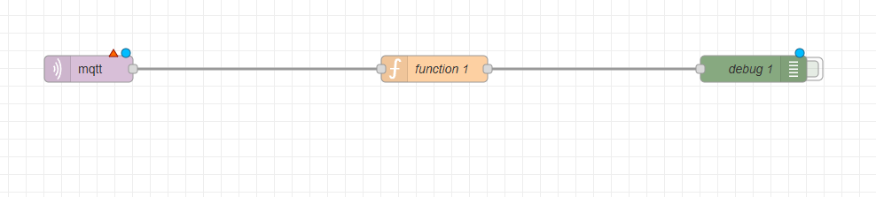
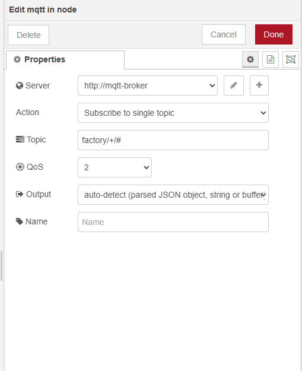
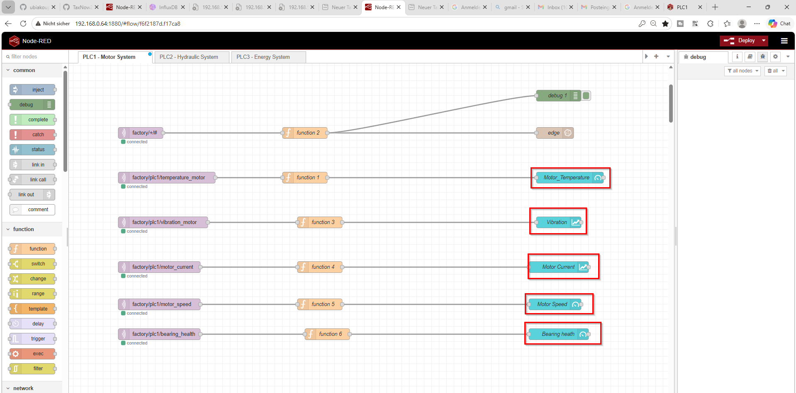
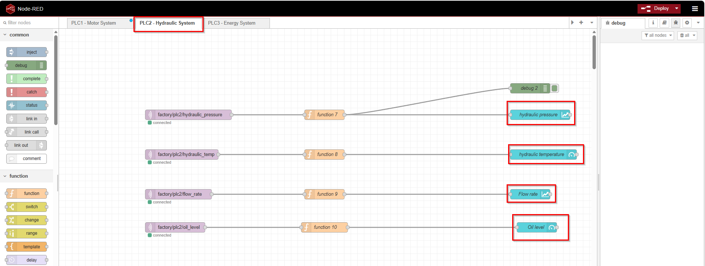
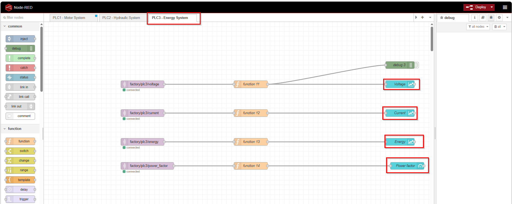
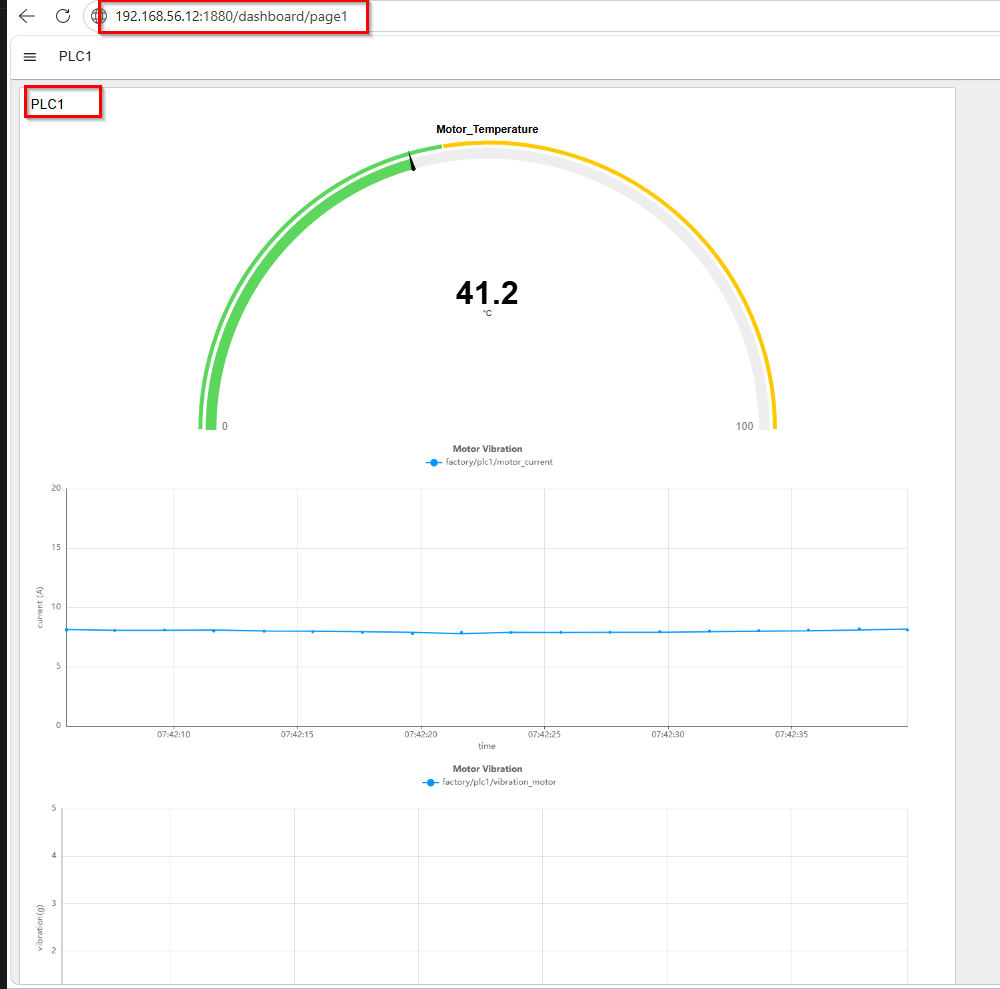

# ✅ Corrigé — TP 05 : Node-RED — Traitement des données IoT (MQTT → Processing)

---

## 🧠 Compréhension globale

Dans ce TP, nous avons introduit **Node-RED** comme moteur de traitement des données dans une architecture IIoT.

👉 Son rôle principal :

- Recevoir les données depuis MQTT  
- Nettoyer les données  
- Transformer les messages  
- Préparer un format exploitable pour le stockage  

---

## 🏗️ Position dans l’architecture

```text
PLC → OPC UA → Data Collector → MQTT → Node-RED → Processing
````

👉 Node-RED agit comme une **couche de transformation (Data Processing Layer)**.

---

# 🚀 Étape 1 — Déploiement

```bash
docker run -d \
  --name node-red \
  --network iiot-network \
  -p 1880:1880 \
  -v node-red-data:/data \
  --restart unless-stopped \
  nodered/node-red
```

---

## 🔍 Vérification

```bash
docker ps
```

---

## 🌐 Accès

```text
http://192.168.56.12:1880
```

---

# 🔧 Étape 2 — Création du flow

---

## 🎯 Flow attendu



```text
MQTT IN → Function → Debug
```

---

## 📡 Configuration MQTT




* **Broker** : `mqtt-broker`
* **Port** : `1883`

---

## 📥 Topic

```text
factory/+/+
```

👉 Permet de recevoir toutes les données du système.

---

# 🧠 Étape 3 — Fonction de traitement (IMPORTANT)

---

## 💻 Code complet (version robuste industrielle)

```javascript
let parts = msg.topic.split("/");

if (parts.length < 3) return null;

let data;
let value;

// Parsing intelligent
if (typeof msg.payload === "string") {
    try {
        data = JSON.parse(msg.payload);
    } catch (e) {
        return null;
    }
} else {
    data = msg.payload;
}

// Filtrage
if (data.tag === "time") return null;

// Extraction
let machine = data.plc || parts[1];
let sensor = data.tag || parts[2];

// Valeur brute
let raw = data.value;

// Conversion industrielle
if (typeof raw === "number") {
    value = raw;
} else if (typeof raw === "string") {
    raw = raw.replace(",", ".").trim();
    value = Number(raw);
} else {
    value = Number(raw);
}

// Validation
if (isNaN(value)) {
    node.warn("Invalid numeric value: " + JSON.stringify(data));
    return null;
}

// Construction
msg.measurement = machine + "_" + sensor;

msg.payload = {
    value: value
};

msg.timestamp = data.timestamp;

return msg;
```

---

# 🔍 Explication détaillée (TRÈS IMPORTANT)

---

## 1. Extraction du topic

```javascript
msg.topic.split("/")
```

Exemple :

```text
factory/plc1/temperature_motor
```

Résultat :

```text
["factory", "plc1", "temperature_motor"]
```

---

## 2. Parsing du payload

Le message peut être :

* JSON string
* Objet déjà parsé

👉 Le code gère les deux cas.

---

## 3. Filtrage

```javascript
if (data.tag === "time") return null;
```

👉 On ignore les messages inutiles.

---

## 4. Extraction

* machine → `plc1`
* capteur → `temperature_motor`
* valeur → `45.2`

---

## 5. Conversion en nombre (CRITIQUE)

👉 MQTT transporte souvent des strings.

👉 Les systèmes aval (InfluxDB, analytics) exigent des **nombres**.

---

## 6. Validation

```javascript
isNaN(value)
```

👉 Empêche l’injection de données invalides.

---

## 7. Measurement

```text
plc1_temperature_motor
```

👉 Format standard time-series.

---

## 8. Structure finale

```json
{
  "measurement": "plc1_temperature_motor",
  "value": 45.2,
  "timestamp": 1710000000
}
```

---

## 9. Déploiement du flow

Après déploiement :


---

# 📊 Partie 4 — Dashboard

---

## 🧩 Installation (GUI Node-RED)

* Menu (☰)
* **Manage Palette**
* Onglet **Install**
* Rechercher :

```
@flowfuse/node-red-dashboard
```

---

## 🏗️ Organisation

👉 Bonne pratique :

**1 page = 1 système**

---

### PLC1 — Motor System



---

### PLC2 — Hydraulic System



---

### PLC3 — Energy System



---

## 🌐 Accès

```text
http://192.168.56.12:1880/dashboard
```

---

## 📈 Exemple — Température moteur (PLC1)

👉 Topic :

```text
factory/plc1/temperature_motor
```

👉 Function utilisée :

```javascript
let value = msg.payload.value;

if (value === undefined) return null;

value = Number(value);

if (isNaN(value)) return null;

msg.payload = value;

return msg;
```

---

## Résultat attendu



👉 Visualisation en temps réel des données industrielles.

---

# 📦 Export du flow (IMPORTANT)

---

## Étapes

* Menu (☰)
* Export
* Clipboard
* Copier le flow complet

---

## 📁 Stockage (DevOps ready)

```text
Smart-factory-iot-edge-to-cloud/
 └── 05_TP_Setup_NodeRED_Data_Processing/
      └── flow/
           └── flows.json
```

---

👉 Le flow final est versionné et réutilisable.

---

# 🧠 Réponses aux exercices

---

## ✅ Exercice 1 — Rôle de Node-RED

* Traitement
* Transformation
* Orchestration

👉 Cœur logique de l’Edge.

---

## ✅ Exercice 2 — Pourquoi transformer ?

* Données brutes inutilisables
* Normalisation
* Préparation au stockage

---

## ✅ Exercice 3 — MQTT IN

* Connexion broker
* Réception messages
* Injection dans le flow

---

## ✅ Exercice 4 — Function

* Logique métier
* Transformation
* Nettoyage

---

## ✅ Exercice 5 — Conversion en nombre

👉 Indispensable :

* Types stricts en base
* Calculs possibles
* Évite erreurs

---

# ⚠️ Problèmes fréquents

---

## ❌ Aucune donnée

* Vérifier MQTT
* Vérifier topic
* Vérifier Data Collector

---

## ❌ Payload incorrect

* Vérifier JSON
* Debug `msg.payload`

---

## ❌ Valeur NaN

* Vérifier format
* Vérifier conversion

---

## ❌ Aucun message

```bash
docker ps
```

👉 Vérifier `mqtt-broker`

---

## ❌ Problème réseau

```bash
docker network inspect iiot-network
```

---

# 🏗️ Architecture finale

```text
PLC → OPC UA → Data Collector → MQTT → Node-RED → Processing → Stockage
```

---

👉 Données prêtes pour :

* InfluxDB
* Grafana

---

# 🏁 Conclusion

Dans ce TP, vous avez :

* Déployé Node-RED
* Connecté MQTT
* Traité des données industrielles
* Construit un pipeline IoT Edge

---

👉 Vous avez maintenant une **brique industrielle clé**.

---

## 🔜 Prochaine étape

👉 Intégration avec **InfluxDB** + **Grafana**

---
